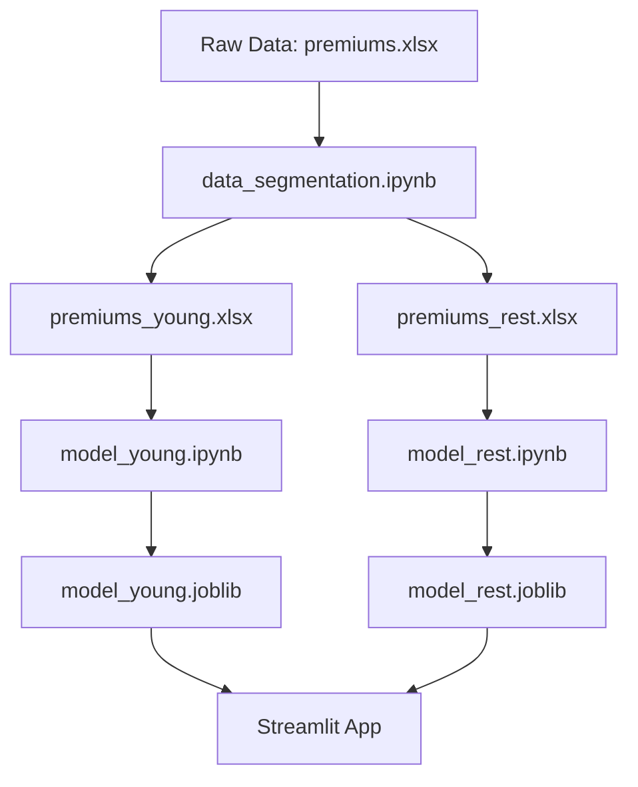

# 📊 Healthcare Premium Prediction - Notebooks

This directory contains Jupyter notebooks for data analysis, model development, and experimentation for the Healthcare Premium Prediction project.

## 📁 Notebook Overview

### 1. Data Processing
- **`data_segmentation.ipynb`** - Data exploration and age-based segmentation

### 2. Model Development
- **`model.ipynb`** - Initial model exploration and baseline
- **`model_young.ipynb`** - Linear regression model for young adults (≤25 years)
- **`model_rest.ipynb`** - XGBoost model for adults (>25 years)
- **`model_young_with_gr.ipynb`** - Enhanced young adult model with genetic risk
- **`model_rest_with_gr.ipynb`** - Enhanced adult model with genetic risk

## 🎯 Workflow



## 🚀 Getting Started

### Prerequisites
```bash
pip install jupyter pandas numpy scikit-learn xgboost matplotlib seaborn
```

### Running Notebooks
```bash
# Start Jupyter Lab
jupyter lab

# Or Jupyter Notebook
jupyter notebook
```

## 📈 Model Performance Summary

| Model | Age Group | Algorithm | R² Score | RMSE | Features |
|-------|-----------|-----------|----------|------|----------|
| Young | ≤25 years | Linear Regression | ~0.85 | ~3,500 | 17 |
| Rest | >25 years | XGBoost | ~0.92 | ~4,200 | 17 |

## 🔧 Data Pipeline

1. **Data Loading**: Load raw premium data from Excel files
2. **Segmentation**: Split data by age (≤25 vs >25)
3. **Feature Engineering**: Create categorical encodings and risk scores
4. **Model Training**: Train separate models for each age group
5. **Model Evaluation**: Cross-validation and performance metrics
6. **Model Saving**: Export trained models to artifacts directory

## 📊 Key Features

### Input Features (17 total)
- **Demographics**: Age, Gender, Marital Status, Region
- **Financial**: Income (Lakhs), Number of Dependants
- **Health**: BMI Category, Medical History, Genetic Risk
- **Lifestyle**: Smoking Status, Employment Status
- **Insurance**: Insurance Plan (Bronze/Silver/Gold)

### Engineered Features
- One-hot encoded categorical variables
- Normalized medical risk scores
- Age-group specific scaling

## 🎨 Visualization Highlights

- Age distribution analysis
- Premium correlation heatmaps
- Feature importance plots
- Model performance comparisons
- Residual analysis plots

## 📝 Notes

- All notebooks use relative paths to `../data/` and `../artifacts/`
- Models are automatically saved to the artifacts directory
- Cross-validation is used for model selection
- Feature scaling is applied separately for each age group

## 🤝 Contributing

When adding new notebooks:
1. Follow the naming convention: `model_[description].ipynb`
2. Use relative paths for data and model files
3. Include markdown cells with explanations
4. Add performance metrics and visualizations
5. Update this README with new notebook descriptions

---

**Last Updated**: October 2025  
**Python Version**: 3.8+  
**Key Libraries**: pandas, scikit-learn, xgboost, matplotlib, seaborn